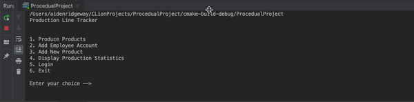
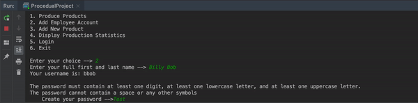

# Procedural Project
This is a Procedural Programming assignment for COP2001 at Florida Gulf Coast University 
Created by: Aiden Ridgeway 
Created on: 5/15/19 
Finished on: 6/21/19 

https://repl.it/@aridgeway00/Procedural-Project

This is a production ine tracker that has many capabilities, including: 
    - Creation of new products 
    - Production tracking 
    - User accounts 
    - Storage and viewing of statistics 
    - And more
    

## Demonstration

## Documentation
Using Doxygen, and the in code javadoc style comments, made a file.

## Getting Started
When the application opens, there is a menu system, 
you should first create new products, then you can properly produce products. 

## Built With
C++11 
IDE: CLion 2019.1.4, on both Mac and Windows 
Other Software: repl.it

## Contributing
Was made individually for school project
Contribution is only needed if asked in my project bugs folder

## Author
Aiden Ridgeway
Florida Gulf Coast University

## License
None yet

## Acknowledgments
Slight constructive criticism from Professor Scott Vanselow

## History

See my GitHub for more version history 
Was created in 6 major sprints see https://sites.google.com/view/prof-v/lms/cop-2001/procedural-project  

## Key Programming Concepts Utilized
--For School Project-- 
Procedural programming 
Loops 
Files 
Structs 
Vectors 

